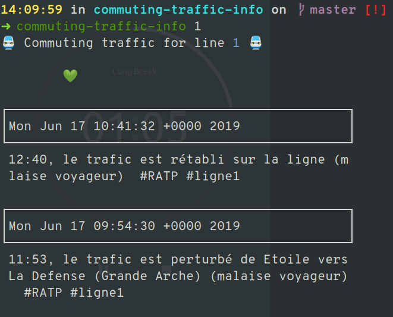

# commuting-traffic-info

> Fetch information about commuting traffic information in Paris.



# Getting started
## Usage

```bash
$ # Install globally
$ go get github.com/l-lin/commuting-traffic-info
$ # Use
$ commuting-traffic-info -h
Check commuting traffic in Paris

Usage:
  commuting-traffic-info [flags]

Flags:
      --config string   config file (default is $HOME/.commuting-traffic-info.yaml)
  -h, --help            help for commuting-traffic-info

$ commuting-traffic-info 1
🚆 Commuting traffic for line 1 🚆

        💚

┌────────────────────────────────────────────┐
│Mon Jun 17 10:41:32 +0000 2019              │
└────────────────────────────────────────────┘
 12:40, le trafic est rétabli sur la ligne (m
 laise voyageur)  #RATP #ligne1

┌────────────────────────────────────────────┐
│Mon Jun 17 09:54:30 +0000 2019              │
└────────────────────────────────────────────┘
 11:53, le trafic est perturbé de Etoile vers
 La Defense (Grande Arche) (malaise voyageur)
   #RATP #ligne1
```

## Build

```bash
make install
```

